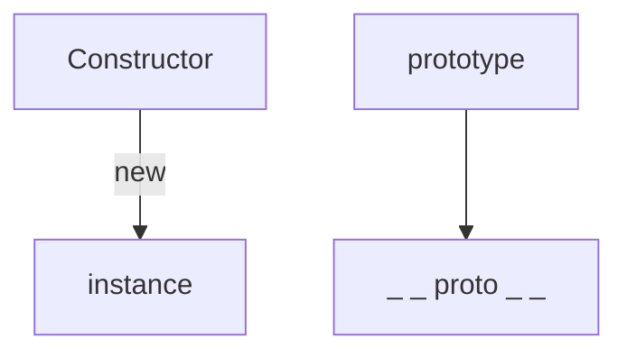
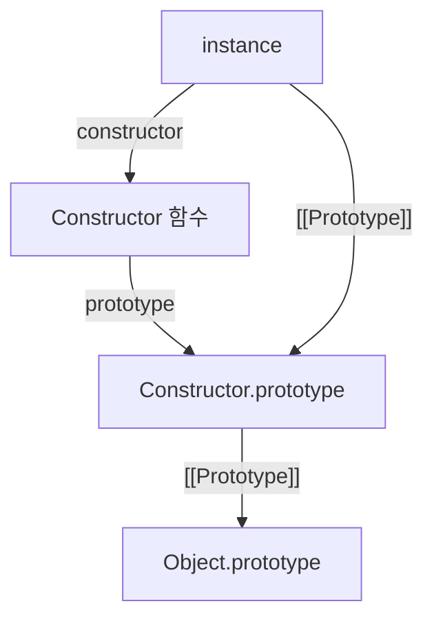

# 프로토타입

### 학습 목표

- 프로토타입이 어떻게 동작하는지 이해한다.
- 프로토타입 체인의 구조를 설명할 수 있다.

## 프로토타입





- 생성자 함수(`Constructor`)를 `new`와 함께 호출하면 인스턴스가 생성됨
- 생성된 인스턴스에는 `[[Prototype]]` 내부 슬롯이 설정됨
- 이 `[[Prototype]]`은 **`Constructor.prototype`을 참조함**

#### new 연산자의 동작

1. 빈 객체 생성
2. `[[Prototype]]`을 `Constructor.prototype`으로 설정
3. `this`를 새 객체에 바인딩
4. 생성자 함수 실행
5. 객체 반환

### `prototype`, `__proto__`, `[[Prototype]]`

- `prototype`: 생성자 함수가 생성할 인스턴스들이 공유할 프로퍼티를 정의하는 객체
- `[[Prototype]]`: 자바스크립트 엔진 내부에 존재하는 숨겨진 연결
  - 직접 접근 불가
- `__proto__`: 객체의 [[Prototype]]에 접근하기 위한 accessor 프로퍼티 (레거시, 권장되지 않음)

#### prototype 객체 접근 방법

```
[Constructor].prototype
[instance].__proto__ (비권장)
Object.getPrototypeOf([instance])
```

## 프로퍼티 탐색과 this

### 프로퍼티 탐색 과정

```js
yeeun.getName();
```

1. `yeeun` 객체에서 `getName` 찾기
2. 없으면 `[[Prototype]]`으로 이동
3. `Constructor.prototype`에서 탐색

=> **프로토타입 체인 탐색**

#### this와의 관계

this는 메소드를 호출한 객체에 따라 결정됨
[ex1.js](./ex1.js), [ex2.js](./ex2.js) 참고

```js
yeeun.getName(); // this = yeeun
yeeun.__proto__.getName(); // this = prototype
```

## constructor 프로퍼티

모든 prototype 객체 내부에는 constructor 프로퍼티가 존재함

- 원래의 생성자 함수(자기 자신)를 참조  
  => 인스턴스로부터 원형이 무엇인지 알 수 있음
- constructor는 일반 프로퍼티이므로 덮어쓸 수 있음
  - 하지만 일반적으로 변경하지 않는 것이 좋음 (프로토타입 관계가 혼동됨)
  - 변경하더라도 참조하는 대상이 변경될 뿐 원형이나 데이터타입이 바뀌는 것은 아님

> primitive 값은 객체가 아니므로 프로퍼티를 직접 가질 수 없어  
> constructor 접근 시에는 임시 wrapper 객체가 생성되고 (boxing)  
> 따라서 constructor를 변경해도 값에는 반영되지 않음

#### constructor 접근 방법

```
[Constructor]
[instance].__proto__.constructor
[instance].constructor
Object.getPrototypeOf([instance]).constructor
[Constructor].prototype.constructor
```

> - instance.constructor를 따라가면 생성자 함수에 접근할 수 있고,
> - 생성자 함수의 constructor는 Function 생성자를 가리킴
> - Function 생성자의 constructor는 자기 자신을 가리키므로 순환 구조를 이룸

## 프로토타입 체인

```js
instance
→ Constructor.prototype
→ Object.prototype
→ null
```

객체의 `[[Prototype]]`이 또 다른 객체를 참조하고, 그 참조가 연쇄적으로 이어지는 구조  
프로토타입 체인을 따라가며 검색하는 것을 프로토타입 체이닝이라고 함

- 프로토타입에서 메소드를 찾더라도 this는 호출한 객체를 가리킴
- 기본적인 객체는 Constructor.prototype과 Object.prototype을 포함하는 구조를 가짐
- 하지만 상속 구조를 구성하면 체인은 더 길어질 수 있음

### 메소드 오버라이드

인스턴스가 prototype에 정의된 것과 동일한 이름의 프로퍼티나 메소드를 가지고 있으면 해당 인스턴스의 프로퍼티/메소드가 호출됨  
prototype의 프로퍼티/메소드는 여전히 유지됨

### 객체 전용 메소드의 예외사항

- 어떤 생성자 함수이든 prototype은 객체이기 때문에 최상단은 `Object.prototype`이 오게 됨
  - Object.prototype에는 모든 객체가 공유하는 메소드가 정의되어 있음
- 특정 인스턴스에 의존하지 않는 메소드는 static method로 정의됨
  - this 대신 명시적으로 객체를 인자로 전달

> `Object.create(null)`은 예외적으로 `Object.prototype`이 존재하지 않는 객체를 생성함  
> 빌트인 메소드/프로퍼티가 제거되어 기능에 제약은 생기지만 객체 자체가 가볍다는 장점이 있음
